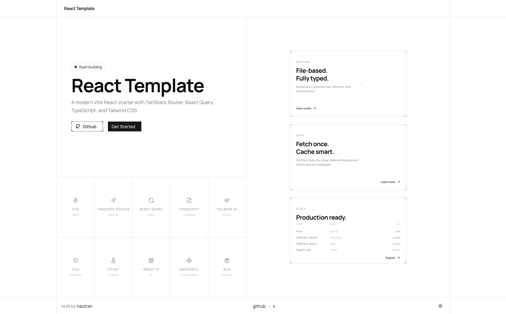

# @dauphaihau/react-template

A Vite + React 19 starter template with TypeScript, TanStack Router, TanStack Query, Tailwind CSS, and a module-based folder structure.

This package is the template source used by the `create-react-template` CLI.



## Architecture Influences

This template is not a strict implementation of a single architecture. It combines a few practical ideas:

- Feature-Sliced Design: inspired by one-way dependency flow and separation between app, module, and shared code.
- Clean Architecture: inspired by separation of concerns and keeping bootstrap code away from reusable logic.
- Colocation: related files stay close to the module or component that owns them.
- Modular architecture: business areas live in `modules/`, while reusable infrastructure lives in `shared/`.
- File-based routing: TanStack Router owns route structure under `app/router/routes/`.

## What's Included

- React 19
- TanStack Router file-based routing
- TanStack Query for server state
- Tailwind CSS v4
- TypeScript
- Vitest
- ESLint
- Husky and lint-staged
- Error boundary with fallback UI
- Zod-validated environment variables
- Theme provider and toggle with light and dark modes
- Module-based folder structure

## Create a Project

Use the CLI package:

```bash
bunx create-react-template my-app
```

Or with npm:

```bash
npx create-react-template my-app
```

Then start the app:

```bash
cd my-app
bun run dev
```

## Template Structure

```txt
src/
├── app/
│   ├── index.tsx             # Entry point, mounts the React app
│   ├── providers/            # App-level providers, such as ThemeProvider
│   ├── router/               # Router factory, generated route tree, and route files
│   │   ├── index.ts          # Router factory
│   │   ├── routeTree.gen.ts  # Auto-generated by TanStack Router
│   │   └── routes/           # File-based route components
│   └── styles/
│       └── styles.css        # Global Tailwind styles
├── modules/                  # Self-contained feature or business-area modules
└── shared/                   # Cross-cutting utilities and infrastructure
    ├── api/                  # Domain API clients and DTOs
    ├── client-state/         # Shared client state, such as theme state
    ├── error/                # Shared error types and error logging helpers
    ├── hooks/                # Generic shared React hooks
    ├── lib/                  # App config, third-party setup, and generic utilities
    ├── server-state/         # TanStack Query operations grouped by domain
    └── ui/                   # Shared UI components
        ├── widgets/          # Composed UI blocks, such as Header and Footer
        ├── app/              # App-aware shared UI, such as ErrorBoundary and ThemeToggle
        └── primitives/       # Generic primitive UI components
```

### Routing

Routes live in `src/app/router/routes/` and are handled by TanStack Router file-based routing.

```txt
routes/
├── __root.tsx
├── index.tsx
├── about.tsx
├── blog.index.tsx
└── blog.$slug.tsx
```

Keep route files focused on routing concerns, data loading, metadata, and page composition. Move reusable logic into `modules/` or `shared/`.

### Module Boundaries

Imports flow downward through the app:

```txt
app -> modules -> shared
```

- `app/` contains application bootstrap, routing, providers, and global styles.
- `modules/` contains feature or business-area code owned by a specific module.
- `shared/` contains code reused across routes or modules.

Modules should not depend on each other directly. If code is needed by multiple modules, move it to `shared/`.

App-level providers live in `app/providers/` and are wired from `app/index.tsx`. Shared provider contracts, such as theme context, live in `shared/client-state/` so both app bootstrap and modules can depend on them without creating module-to-module imports.

For example, if two modules need the same app-aware component, place it under `shared/ui/app/` instead of copying it into both modules:

```txt
shared/ui/app/
└── account-status-badge/
    ├── account-status-badge.tsx
    └── index.ts
```

If the component is a generic UI primitive with no app knowledge, place it under `shared/ui/primitives/` instead.

### Naming Conventions

- File and directory names use lowercase kebab-case: `theme-toggle.tsx`, `error-display/`.
- React component symbols use PascalCase: `ThemeToggle`, `ErrorBoundary`.
- Test files live next to the code they cover: `button.test.tsx`, `utils.test.ts`.

### Component Structure

Use the smallest structure that keeps the component readable.

Self-contained components stay as a single file:

```txt
modules/account/
└── account-status.tsx
```

Use a folder when the component has supporting UI pieces or local support files:

```txt
modules/account/components/account-menu/
├── index.ts              # Re-export only
├── account-menu.tsx      # Root component logic
├── account-menu-item.tsx
├── account-menu-footer.tsx
├── constants.ts          # Local labels, config, limits, or option lists
├── types.ts              # Local types only
└── utils.ts              # Pure local helpers
```

Use a nested folder when a child component has its own subcomponents or support files:

```txt
modules/account/components/account-menu/
├── index.ts
├── account-menu.tsx
└── account-menu-section/
    ├── index.ts
    ├── account-menu-section.tsx
    ├── account-menu-section-item.tsx
    └── types.ts
```

Do not create extra files for trivial content. `index.ts` is re-export only; do not put JSX or component logic there.

### State and Data

- Server state query options, hooks, and mutations belong in `shared/server-state/{domain}/`.
- Shared client-only state belongs in `shared/client-state/`.
- Generic reusable React hooks belong in `shared/hooks/`; server-state hooks stay with their query or mutation operation.
- Domain API access and DTOs belong in `shared/api/{domain}/`.
- Shared API client setup belongs in `shared/lib/`.
- Shared error types and error logging helpers belong in `shared/error/`.
- Module-local UI behavior belongs inside the owning module.

Group server-state files by domain and operation:

```txt
shared/server-state/blog/
├── index.ts
├── query-keys.ts
├── create-blog.mutation.ts
├── get-blog.query.ts
└── get-blogs.query.ts
```

Each domain should keep query keys local to that domain. Use query option helpers for exact query reuse, and the domain key factory for partial invalidation groups.

```ts
queryClient.invalidateQueries({ queryKey: blogQueryKeys.all });
queryClient.invalidateQueries({ queryKey: blogQueryKeys.lists() });
```

Each query operation can export both query options and a React hook. Keep query options separate when the same operation may be reused by non-component code such as router loaders, prefetching, `queryClient.ensureQueryData`, or exact cache invalidation:

```ts
queryClient.prefetchQuery(getBlogQueryOptions(id));
queryClient.ensureQueryData(getBlogQueryOptions(id));
queryClient.invalidateQueries({ queryKey: getBlogQueryOptions(id).queryKey });
```

Mutation operations live beside query operations and should invalidate the smallest useful domain key:

```ts
export function useCreateBlogMutation() {
  const queryClient = useQueryClient();

  return useMutation({
    mutationFn: (payload: CreateBlogPostDto) => blogApi.create(payload),
    onSuccess: () => {
      void queryClient.invalidateQueries({ queryKey: blogQueryKeys.lists() });
    },
  });
}
```

Group API files by domain. Keep DTOs separate from endpoint functions so large response contracts do not bloat transport code:

```txt
shared/api/blog/
├── index.ts
├── dto.ts
├── blog.api.ts
└── blog.api.test.ts
```

Small endpoint groups can be exposed as one object:

```ts
blogApi.list();
blogApi.detail(id);
blogApi.create(payload);
```

### Path Alias

The `#/` alias maps to `src/`:

```ts
import { Button } from '#/shared/ui';
import { useErrorHandler } from '#/shared/hooks/use-error-handler';
import { ThemeToggle } from '#/shared/ui/app';
import { queryClient } from '#/shared/lib/query-client';
```

## Scripts

Inside a generated project:

```bash
bun run dev
bun run build
bun run test
bun run lint
```

## Related Package

The CLI is published as `@dauphaihau/create-react-template`.

## License

MIT
